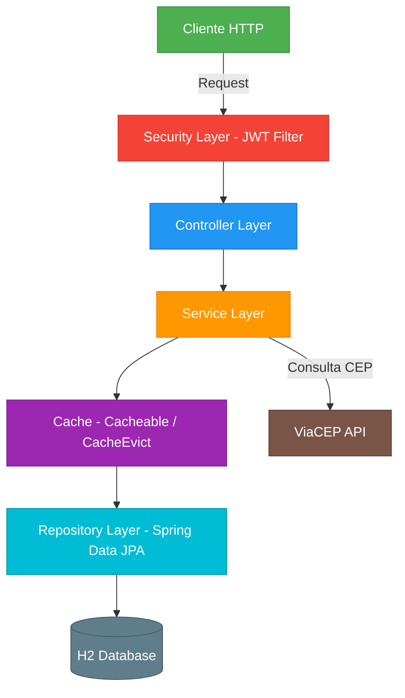
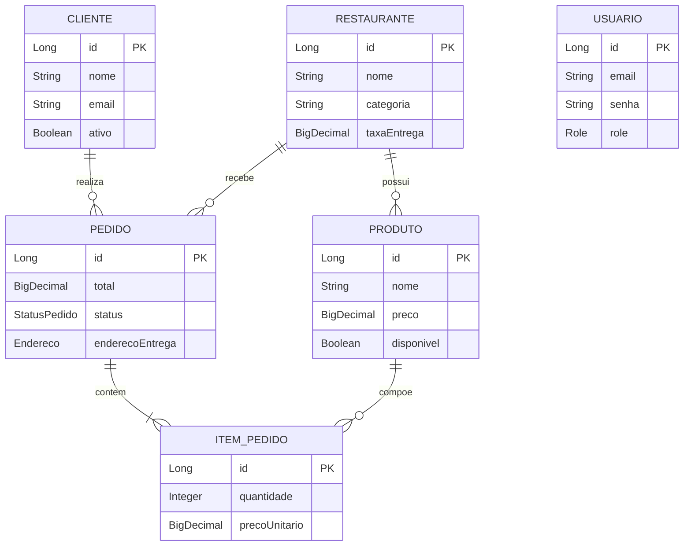

# 📦 DeliveryTech API

API RESTful desenvolvida com **Spring Boot 3** e **Java 21** para gerenciar um sistema de delivery completo. Este projeto simula as funcionalidades principais de plataformas como iFood e Uber Eats, incluindo autenticação JWT, cache em memória, monitoramento com Actuator, CI/CD com GitHub Actions, documentação interativa com Swagger e containerização com Docker.

---

## 📐 Arquitetura do Sistema

O projeto segue o padrão de arquitetura em camadas (**Layered Architecture**), separando responsabilidades de forma clara:

### Fluxo de Camadas



### Modelo de Entidades



### Padrões e Decisões de Projeto

| Decisão | Detalhes |
|---------|----------|
| **Autenticação** | JWT stateless com filtro customizado (`JwtAuthenticationFilter`) |
| **Autorização** | Controle por roles: `ADMIN`, `CLIENTE`, `RESTAURANTE`, `ENTREGADOR` |
| **Cache** | Spring Cache (`@Cacheable` / `@CacheEvict`) em memória nos endpoints de listagem |
| **Validação** | Bean Validation (`@Valid`) + validador customizado `@ValidCEP` |
| **Tratamento de erros** | `@RestControllerAdvice` com `GlobalExceptionHandler` |
| **Documentação** | Swagger/OpenAPI 3 com autenticação JWT integrada |
| **Monitoramento** | Spring Boot Actuator (`/actuator/health`, `/actuator/metrics`) |
| **CI/CD** | GitHub Actions (`mvn clean verify` a cada push) |

---

## 🚀 Funcionalidades

- ✅ Cadastro e login de usuários com **JWT**
- ✅ Controle de acesso por perfis (`CLIENTE`, `RESTAURANTE`, `ADMIN`, `ENTREGADOR`)
- ✅ CRUD de clientes, restaurantes e produtos
- ✅ Criação de pedidos com itens e cálculo automático do total
- ✅ Atualização de status de pedido
- ✅ Cache em memória com invalidação automática
- ✅ Consulta de endereço via **ViaCEP**
- ✅ Testes de integração com **MockMvc**
- ✅ Documentação interativa com **Swagger/OpenAPI**
- ✅ Monitoramento com **Spring Boot Actuator**
- ✅ Containerização com **Docker** e **Docker Compose**
- ✅ Pipeline CI/CD com **GitHub Actions**

---

## 🧪 Tecnologias Utilizadas

| Categoria | Tecnologia |
|-----------|------------|
| **Linguagem** | Java 21 |
| **Framework** | Spring Boot 3.2.5 |
| **Persistência** | Spring Data JPA + H2 Database |
| **Segurança** | Spring Security + JWT (jjwt 0.11.5) |
| **Validação** | Spring Validation + Bean Validation |
| **Cache** | Spring Cache (in-memory / simple) |
| **Documentação** | SpringDoc OpenAPI 2.6.0 (Swagger UI) |
| **Monitoramento** | Spring Boot Actuator |
| **Testes** | JUnit 5 + Mockito + MockMvc |
| **Build** | Maven 3.9+ |
| **Container** | Docker + Docker Compose |
| **CI/CD** | GitHub Actions |

---

## ⚙️ Como Rodar o Projeto

### 🔧 Pré-requisitos

- **Java 21** (JDK)
- **Maven 3.9+**
- **Docker** e **Docker Compose** (opcional, para execução containerizada)

### 🖥️ Execução Local (Maven)

```bash
# Clonar o repositório
git clone https://github.com/seuusuario/delivery-api.git
cd delivery-api

# Compilar e rodar
./mvnw spring-boot:run
```

A API estará disponível em: `http://localhost:8080`

### 🐳 Execução via Docker

```bash
# Build e execução com Docker Compose (recomendado)
docker-compose up --build

# Ou build manual da imagem
docker build -t deliverytech-api .
docker run -p 8080:8080 deliverytech-api
```

### 🔎 URLs Importantes

| URL | Descrição |
|-----|-----------|
| `http://localhost:8080/swagger-ui.html` | Documentação interativa (Swagger UI) |
| `http://localhost:8080/api-docs` | Especificação OpenAPI (JSON) |
| `http://localhost:8080/actuator/health` | Status de saúde da aplicação |
| `http://localhost:8080/actuator/metrics` | Métricas da aplicação |
| `http://localhost:8080/h2-console` | Console do banco H2 |

---

## 🔐 Autenticação e Autorização

A API utiliza autenticação **JWT (JSON Web Token)**. Para acessar os endpoints protegidos:

### 1. Registrar um usuário

```bash
curl -X POST http://localhost:8080/api/auth/register \
  -H "Content-Type: application/json" \
  -d '{
    "email": "admin@teste.com",
    "senha": "123456",
    "nome": "Admin",
    "role": "ADMIN"
  }'
```

### 2. Fazer login (caso já registrado)

```bash
curl -X POST http://localhost:8080/api/auth/login \
  -H "Content-Type: application/json" \
  -d '{
    "email": "admin@teste.com",
    "senha": "123456"
  }'
```

### 3. Usar o token retornado

```bash
curl -H "Authorization: Bearer <SEU_TOKEN_JWT>" \
  http://localhost:8080/api/restaurantes
```

> 💡 **Dica:** No Swagger UI, clique no botão **Authorize** 🔒 e cole o token JWT para testar os endpoints diretamente pelo navegador.

### Permissões por Role

| Role | Permissões |
|------|-----------|
| `ADMIN` | Acesso total: cadastrar/editar restaurantes, produtos, clientes |
| `CLIENTE` | Criar/visualizar pedidos, gerenciar próprio perfil |
| `RESTAURANTE` | Gerenciar produtos do seu restaurante |
| `ENTREGADOR` | Visualizar pedidos para entrega |

---

## 📡 Endpoints Principais

### Autenticação (`/api/auth`)

| Método | Endpoint | Descrição |
|--------|----------|-----------|
| `POST` | `/api/auth/register` | Registrar novo usuário |
| `POST` | `/api/auth/login` | Login e obtenção do token JWT |

### Clientes (`/api/clientes`)

| Método | Endpoint | Descrição |
|--------|----------|-----------|
| `POST` | `/api/clientes` | Cadastrar cliente |
| `GET` | `/api/clientes` | Listar clientes ativos (paginado) |
| `GET` | `/api/clientes/{id}` | Buscar cliente por ID |
| `PUT` | `/api/clientes/{id}` | Atualizar cliente |
| `PATCH` | `/api/clientes/{id}/status` | Ativar/desativar cliente |

### Restaurantes (`/api/restaurantes`)

| Método | Endpoint | Descrição |
|--------|----------|-----------|
| `POST` | `/api/restaurantes` | Cadastrar restaurante |
| `GET` | `/api/restaurantes` | Listar restaurantes (paginado) |
| `GET` | `/api/restaurantes/{id}` | Buscar por ID |
| `GET` | `/api/restaurantes/categoria/{categoria}` | Buscar por categoria |
| `PUT` | `/api/restaurantes/{id}` | Atualizar restaurante |

### Produtos (`/api/produtos`)

| Método | Endpoint | Descrição |
|--------|----------|-----------|
| `POST` | `/api/produtos` | Cadastrar produto |
| `GET` | `/api/produtos/restaurante/{id}` | Listar produtos por restaurante |
| `PUT` | `/api/produtos/{id}` | Atualizar produto |
| `PATCH` | `/api/produtos/{id}/disponibilidade` | Alterar disponibilidade |

### Pedidos (`/api/pedidos`)

| Método | Endpoint | Descrição |
|--------|----------|-----------|
| `POST` | `/api/pedidos` | Criar pedido com itens |

---

## 🧪 Testes

### Executar todos os testes

```bash
./mvnw test
```

### Executar testes específicos

```bash
# Testes de integração do PedidoController
./mvnw test -Dtest="PedidoControllerTest"

# Testes do ClienteController
./mvnw test -Dtest="ClienteControllerTest"
```

Os testes de integração utilizam:
- **MockMvc** para simular chamadas HTTP reais
- **H2 em memória** (`application-test.properties`) para isolamento
- **`@Transactional`** para rollback automático entre testes

---

## 📊 Monitoramento

O Spring Boot Actuator expõe endpoints de monitoramento:

```bash
# Verificar saúde da aplicação
curl http://localhost:8080/actuator/health

# Ver métricas disponíveis
curl http://localhost:8080/actuator/metrics

# Exemplo: uso de memória JVM
curl http://localhost:8080/actuator/metrics/jvm.memory.used
```

---

## 🔄 CI/CD

O projeto possui pipeline de integração contínua configurada com **GitHub Actions** (`.github/workflows/ci.yml`):

- **Trigger:** Push e Pull Request nas branches `main`, `master` e `develop`
- **Etapas:** Checkout → JDK 21 (Temurin) → `mvn clean verify`

---

## 📁 Estrutura do Projeto

```
delivery/
├── .github/workflows/ci.yml       # Pipeline CI/CD
├── Dockerfile                      # Build multi-stage (Maven + JDK 21)
├── docker-compose.yml              # Orquestração de containers
├── pom.xml                         # Dependências Maven
├── src/main/java/com/deliverytech/
│   ├── DeliveryTechApiApplication.java   # Classe principal (@EnableCaching)
│   ├── config/                     # Configurações (Security, OpenAPI, Cache)
│   ├── controller/                 # Controllers REST (5 controllers)
│   ├── dto/                        # Request/Response DTOs
│   ├── exception/                  # Tratamento global de exceções
│   ├── model/                      # Entidades JPA
│   ├── repository/                 # Repositórios Spring Data
│   ├── security/                   # JWT Filter e utilitários
│   ├── service/                    # Interfaces de serviço
│   └── service/impl/              # Implementações com cache e logs
├── src/main/resources/
│   └── application.properties      # Configuração da aplicação
└── test/
    ├── java/                       # Testes de integração (MockMvc)
    └── resources/                  # application-test.properties
```

---

## 📬 Contato

Projeto desenvolvido como parte do curso de **Arquitetura de Sistemas**.
